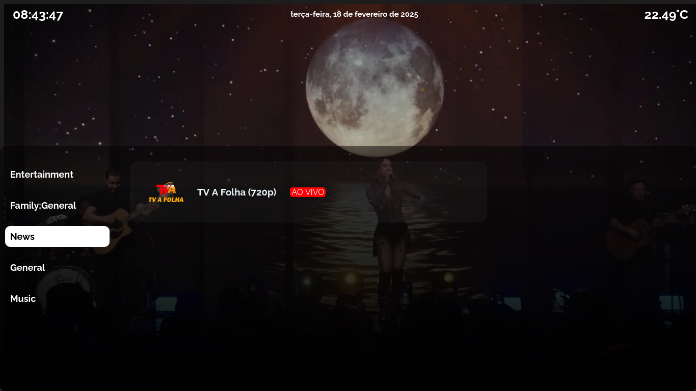

# IPTV Player - Node.js

Este aplicativo é um player de vídeo/streaming desenvolvido em Node.js para reproduzir listas IPTV no formato M3U. Além disso, ele permite ler, criar e editar arquivos M3U, facilitando a gestão das listas de canais. 

## Funcionalidades
- Carregamento de listas M3U
- Execução de canais e mídias em um player de vídeo
- Listagem de canais, filmes e midias por categorias
- Exibição de ícones de canais
- Edição, criação e exportação de listas customizadas
- Suporte a programação de TV (EPG)
- Login e controle de acesso
- Suporte a multiplos usuários com configurações individuais
- Relógio e previsão do tempo
- Interface simples e intuitiva

## Tecnologias Utilizadas
- Node.js
- Express (se aplicável)
- Módulos para manipulação de arquivos

## Dependências
Este projeto utiliza as seguintes dependências:
- **express** (^4.21.1): Framework web para Node.js, usado para criar o servidor HTTP do player.
- **http-proxy-middleware** (^3.0.3): Middleware para criar proxies HTTP, útil para lidar com redirecionamentos de requisições.
- **m3u8-parser** (^7.2.0): Biblioteca para analisar e manipular listas de reprodução no formato M3U8.
- **moment** (^2.30.1): Biblioteca para manipulação e formatação de datas, útil para exibir programação de TV (EPG).
- **xml2js** (^0.6.2): Biblioteca para converter XML em JSON, essencial para processar dados de guias eletrônicos de programação (EPG).

## Instalação
1. Clone este repositório:
   ```bash
   git clone https://github.com/Brenin1991/iptv-player.git
   ```
2. Acesse o diretório do projeto:
   ```bash
   cd iptv-player
   ```
3. Instale as dependências:
   ```bash
   npm install
   ```

## Uso
Para iniciar o aplicativo, execute:
```bash
npm start
```

Caso haja uma interface web:
Acesse no navegador: `http://localhost:3000`




## Observações Importantes
Este aplicativo é apenas um player para o protocolo IPTV e **não fornece canais ou listas IPTV**. O usuário deve possuir e carregar suas próprias listas M3U. O projeto **não viola nenhum direito autoral**, pois apenas reproduz os conteúdos que o próprio usuário fornecer.

## Contribuição
Sinta-se à vontade para abrir issues e enviar pull requests!

## Licença
Este projeto está licenciado sob a [MIT License](LICENSE).

